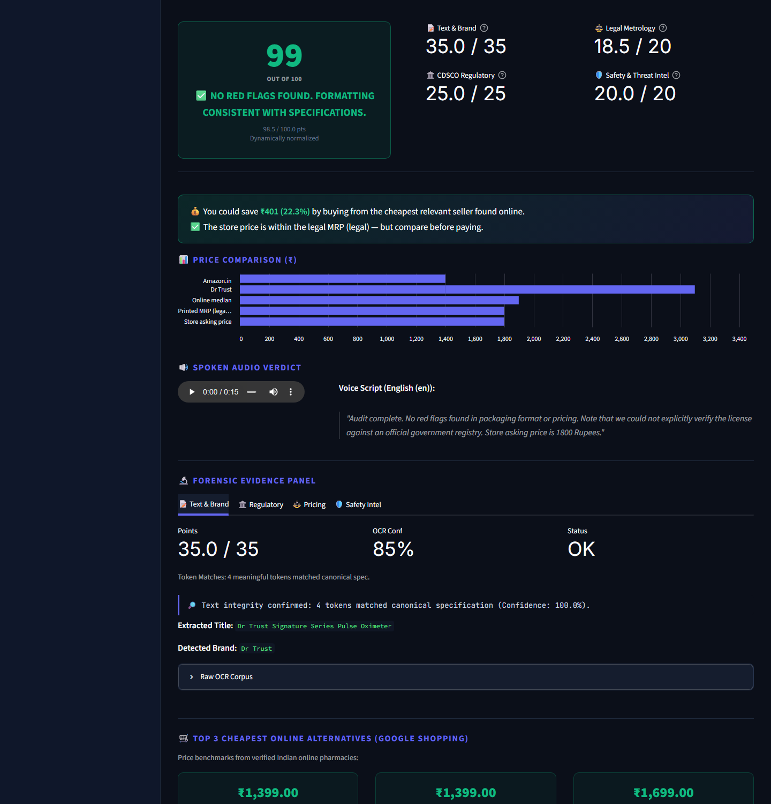
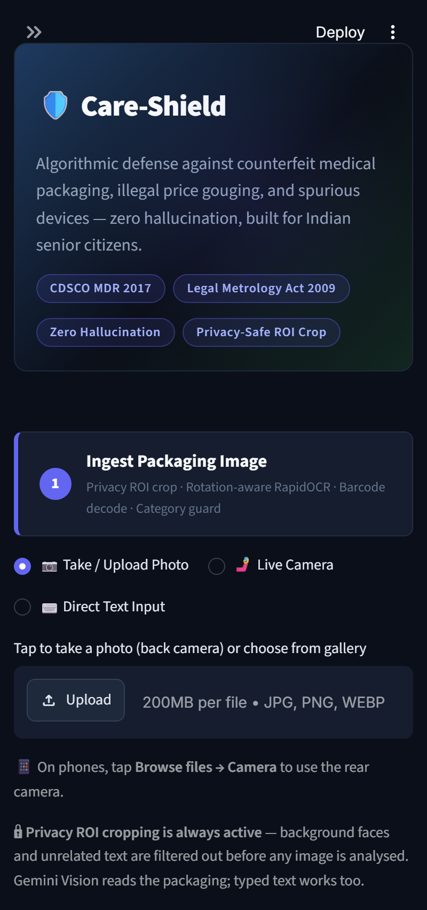
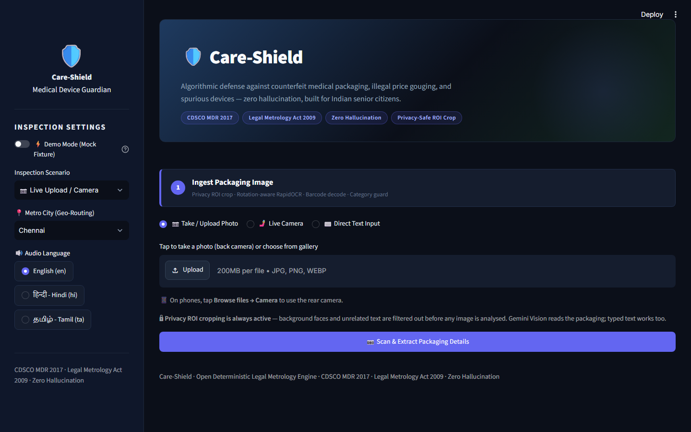
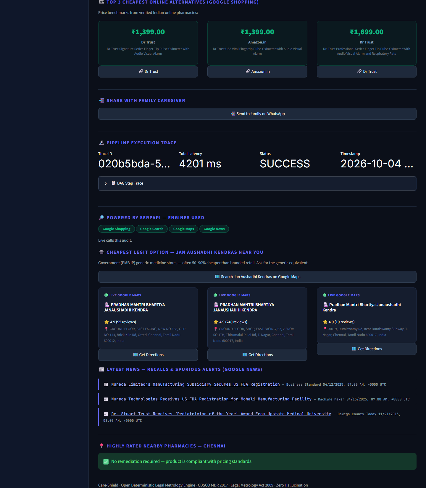

# 🛡️ Care-Shield — Medical Device Guardian

[](https://care-shield-awdfuejzzvdctwjjtkgeup.streamlit.app/)

> 🚀 **Live app:** **[https://care-shield-awdfuejzzvdctwjjtkgeup.streamlit.app/](https://care-shield-awdfuejzzvdctwjjtkgeup.streamlit.app/)**

> **Before you pay:** is it the right product, is the price fair, and where is it cheapest? Scan a medical device or medicine and get live market prices, counterfeit/recall checks and the legal MRP ceiling — powered by **SerpApi**.

Built for the **SerpApi India Hackathon 2026** · Track: **Knowledge & Public Interest** (accessibility, consumer protection, news) · also relevant to *Commerce & Market Intelligence*.


<p align="center">
  
  
</p>

## The problem

Families buying BP monitors, oximeters, glucometers, braces or OTC medicines can't tell:

- **Is this the fair price?** Pharmacies sell at the printed MRP, which is only a *legal ceiling* — the same product is often 20–40 % cheaper online or at Jan Aushadhi stores. Nobody checks.
- **Is it genuine?** Counterfeit / spurious devices carry knock-off spellings and malformed CDSCO licence numbers, and recalls are hard to find.
- **Where is it cheapest?** Comparing sellers by hand, in a shop, on a small phone, is unrealistic — especially for seniors.

(Charging *above* MRP is illegal under *Legal Metrology Act 2009 §36*, so Care-Shield checks that too, but the everyday saving comes from the market comparison.)

## What Care-Shield does

1. **Scan** a packaging photo (rear camera / gallery), or type the text.
2. **Extract** MRP, licence, batch, brand — locally (RapidOCR) with optional Gemini Vision; privacy ROI crop first.
3. **Audit** with live SerpApi data and a deterministic, explainable **Trust Score (0–100)**.
4. **Act**: rupee savings, refund-the-excess prompt, cheaper sellers, Jan Aushadhi Kendras, recall news, nearby pharmacies, one-tap WhatsApp share to a family caregiver, and a spoken verdict in **English / हिन्दी / தமிழ்**.

## Why it matters (for judges)

| Criterion | Care-Shield |
|---|---|
| **Idea & insight** | A concrete, widespread harm: seniors overpaying or buying spurious medical devices. Combines *law* (Legal Metrology §36, CDSCO MDR 2017) with live market data. |
| **Originality** | Turns a search API into a **consumer-protection tool**: price-gouging detection against the legal MRP, Jan Aushadhi generic-store routing, recall news, family WhatsApp alert. |
| **Technical complexity** | Rotation-aware local OCR + Gemini Vision, barcode decode, privacy ROI crop, IQR statistics, deterministic scoring with N/A renormalisation, Pydantic-validated DAG with execution trace, automatic Gemini fallback, offline eval suite + CI. |
| **Practical usefulness** | Works on a phone (rear camera), speaks the verdict in **English / हिन्दी / தமிழ்**, shows rupees saved and exactly what to do next. |
| **Meaningful SerpApi use** | Shopping, Search, Maps (×2) and News power every external fact — remove SerpApi and the app has no prices, recalls, stores or news. |

## 🔎 How Care-Shield uses SerpApi

SerpApi supplies every external fact — nothing is invented. Without a key the app says so instead of faking data.

| SerpApi engine | File | Purpose |
|---|---|---|
| `google_shopping` | `core/parity_checker.py` | Online price benchmark (IQR outlier-filtered median) vs. store price and printed MRP |
| `google` | `core/safety_intel.py` | Adversarial search for CDSCO recalls, seizures, counterfeit alerts |
| `google` | `core/deviation_guard.py` | Canonical product-spec lookup for typo / knock-off detection |
| `google_maps` | `core/map_router.py` | Highly-rated nearby pharmacies when a product is flagged |
| `google_maps` | `core/extras.py` | Nearest **Jan Aushadhi Kendras** (government generic stores, often 50–90 % cheaper) |
| `google_news` | `core/extras.py` | Latest recall / spurious / overcharging headlines for the brand |

### Automatic Gemini fallback

If SerpApi is unavailable (quota exhausted, error, timeout), Care-Shield automatically switches to **Gemini with Google Search grounding** (`core/gemini_fallback.py`) for price benchmarks, recall intelligence and news — real web sources only, labelled "fallback" in the UI. If even that is unavailable, only a clearly labelled *AI estimate* is shown and it is never used in the score. (Google Lens via SerpApi is kept in the code for public image URLs; Gemini Vision is the default image reader.)

## Architecture

```
 Photo / camera / text
        │  privacy ROI crop → RapidOCR (+ Gemini) → barcode → category guard
        ▼
 PackagingOCRResult (Pydantic)   ← category: device / OTC medicine / cosmetic / prescription (refused) / not-healthcare (refused)
        │
   ┌────┼────────────────────────┐
   ▼    ▼                        ▼
 Metrology & price      Regulatory & text        Threat intel
 SerpApi Shopping       CDSCO MDR 2017 regex     SerpApi Search
 (IQR median, MRP)      fuzzy knock-off check    (recalls, seizures)
   └────┼────────────────────────┘
        ▼
 Deterministic scoring engine  (Text 35 · Regulatory 25 · Pricing 20 · Safety 20, N/A renormalised)
        ▼
 Streamlit dashboard: score · savings · chart · audio · evidence · Jan Aushadhi · news · pharmacies · WhatsApp
```

**Design principles:** zero hallucination (missing fields shown as *Not provided / Not found*), prescription drugs are refused (not audited), every inter-stage hop validated with Pydantic v2, every external call has a timeout + retry + graceful fallback, API keys are never shown or logged.

## Run locally

```bash
git clone https://github.com/venki-byte/care-shield.git
cd care-shield
python -m venv .venv && .venv\Scripts\activate      # Windows  (source .venv/bin/activate on Mac/Linux)
pip install -r requirements.txt
cp .env.example .env        # then add your keys
streamlit run app.py
```

Open http://localhost:8501. Use the sidebar **Demo Mode** to try it with no API calls.

`.env`:
```
SERPAPI_API_KEY=your_serpapi_key       # required for live results
GEMINI_API_KEY=your_gemini_key         # optional (better OCR)
```

Tests: `python test_pipeline.py` (10 checks, incl. an offline 5-case evaluation suite).

## Deploy (Streamlit Community Cloud)

New app → this repo → `app.py` → **Python 3.12** → Secrets:
```toml
SERPAPI_API_KEY = "..."
GEMINI_API_KEY = "..."
```
`packages.txt` installs the system libraries needed for barcode decoding.

## Project layout

```
app.py              Streamlit dashboard
config.py           keys, weights, retry helper, city coordinates
schemas.py          Pydantic v2 models for every stage
audio.py            English / Hindi / Tamil spoken verdict (gTTS)
core/
  vision_ingest.py  ROI crop, OCR, barcode, Gemini, Lens
  deviation_guard.py  CDSCO licence + knock-off text check
  parity_checker.py   Google Shopping price parity
  safety_intel.py     recall / counterfeit search
  scoring_engine.py   deterministic trust score
  map_router.py       nearby pharmacies
  extras.py           Jan Aushadhi, news, savings
  pipeline.py         DAG orchestration + execution trace
fixtures/ eval/     demo replay data and offline evaluation
```

## AI disclosure

This project was built with the assistance of AI coding tools (Claude Code). All logic was reviewed and tested by the author.

## Screenshots

| Home | SerpApi engines, Jan Aushadhi, news, pharmacies |
|---|---|
|  |  |

## License

MIT — see [LICENSE](LICENSE).

## Legal note

Care-Shield provides algorithmic guidance, not legal or medical advice. Scores are indicators — verify with the seller, manufacturer or the National Consumer Helpline (**1915**).
